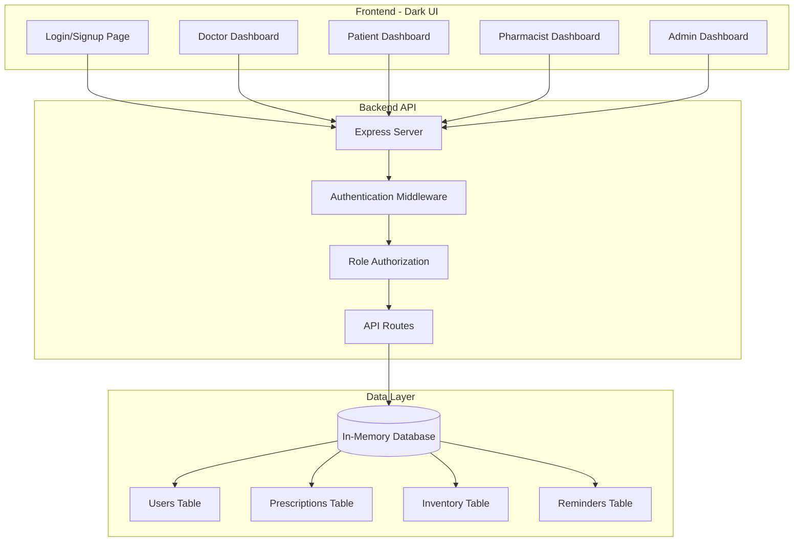
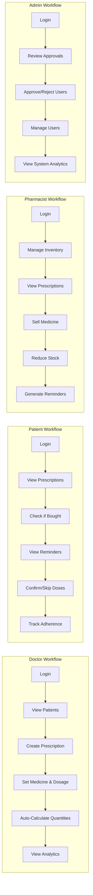
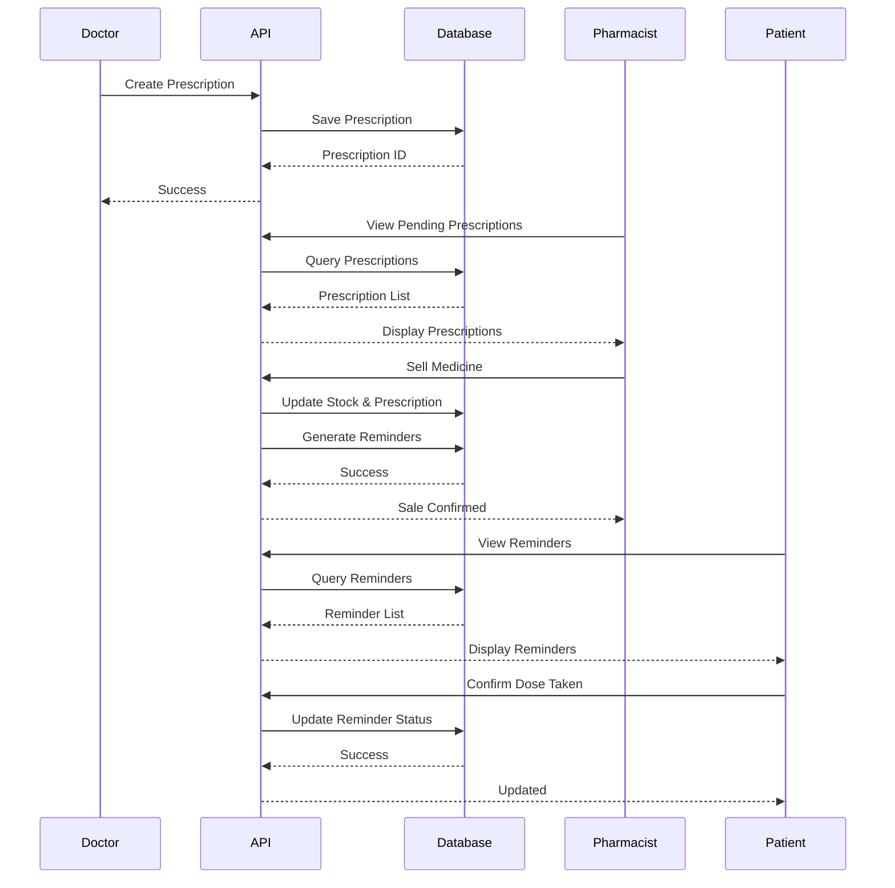
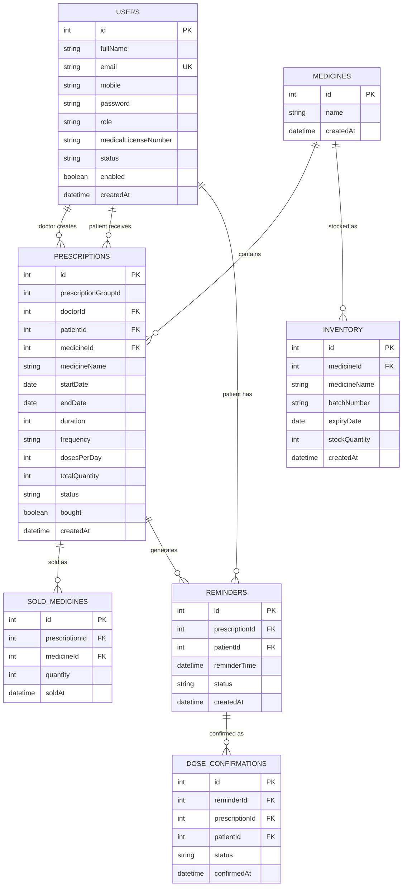
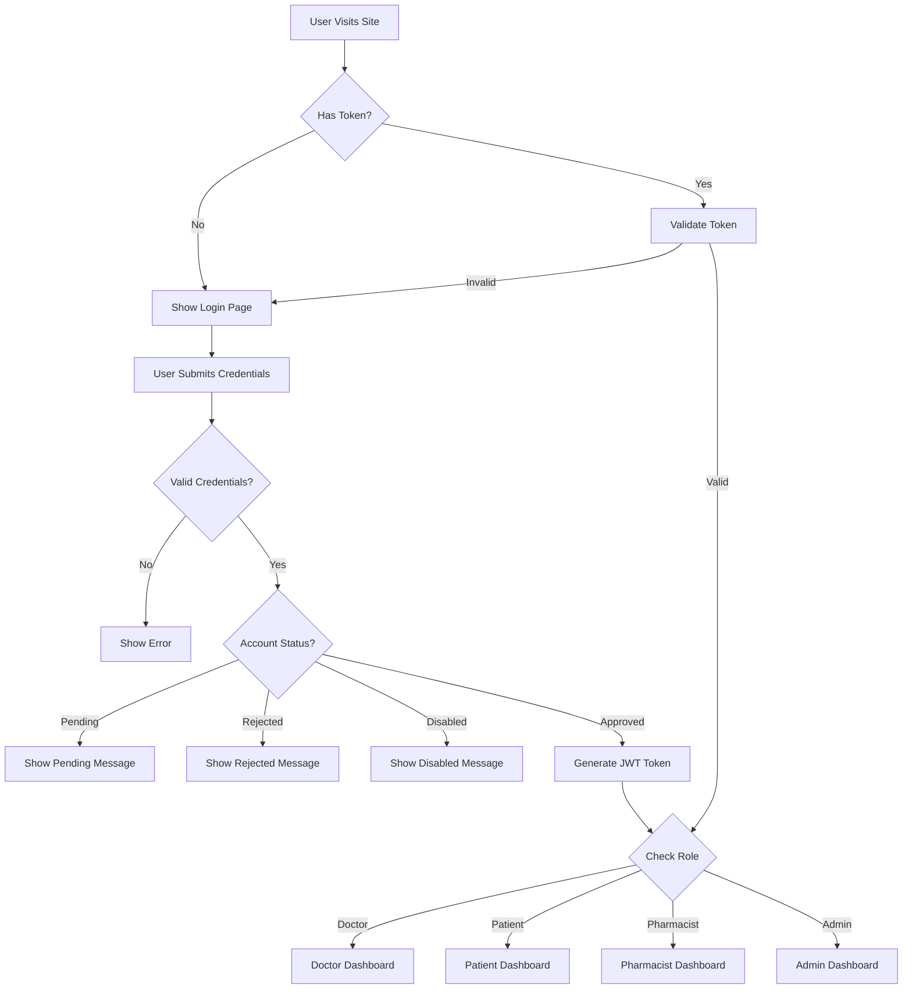
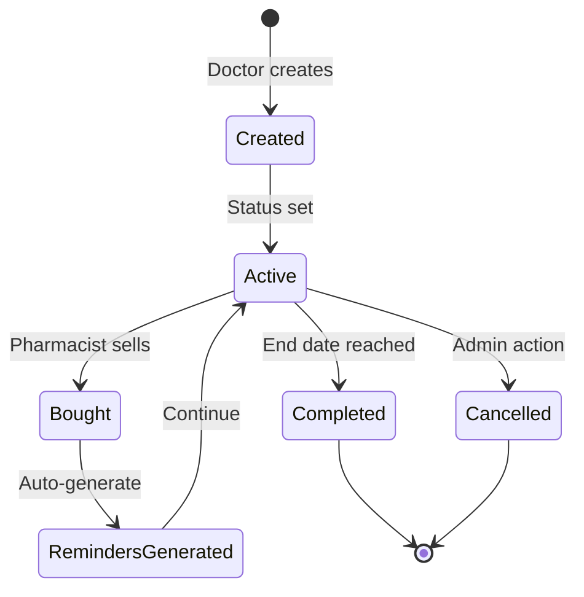
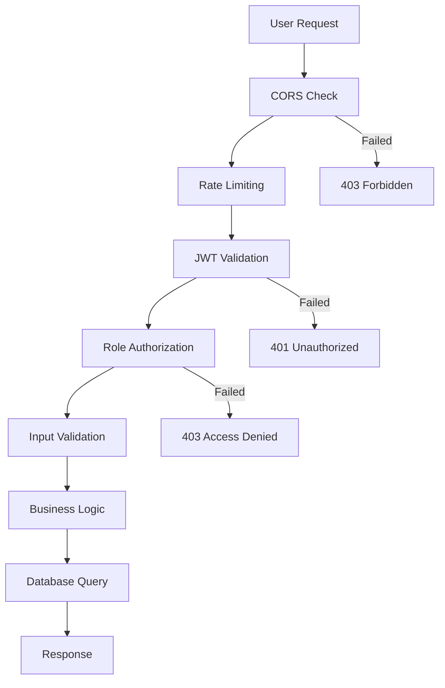

# System Architecture

## Application Flow Diagram

```mermaid
graph TB
    subgraph "Frontend - Dark UI"
        A[Login/Signup Page]
        B[Doctor Dashboard]
        C[Patient Dashboard]
        D[Pharmacist Dashboard]
        E[Admin Dashboard]
    end
    
    subgraph "Backend API"
        F[Express Server]
        G[Authentication Middleware]
        H[Role Authorization]
        I[API Routes]
    end
    
    subgraph "Data Layer"
        J[(In-Memory Database)]
        K[Users Table]
        L[Prescriptions Table]
        M[Inventory Table]
        N[Reminders Table]
    end
    
    A --> F
    B --> F
    C --> F
    D --> F
    E --> F
    
    F --> G
    G --> H
    H --> I
    
    I --> J
    J --> K
    J --> L
    J --> M
    J --> N
```

## User Role Workflows

```mermaid
graph LR
    subgraph "Doctor Workflow"
        D1[Login] --> D2[View Patients]
        D2 --> D3[Create Prescription]
        D3 --> D4[Set Medicine & Dosage]
        D4 --> D5[Auto-Calculate Quantities]
        D5 --> D6[View Analytics]
    end
    
    subgraph "Patient Workflow"
        P1[Login] --> P2[View Prescriptions]
        P2 --> P3[Check if Bought]
        P3 --> P4[View Reminders]
        P4 --> P5[Confirm/Skip Doses]
        P5 --> P6[Track Adherence]
    end
    
    subgraph "Pharmacist Workflow"
        PH1[Login] --> PH2[Manage Inventory]
        PH2 --> PH3[View Prescriptions]
        PH3 --> PH4[Sell Medicine]
        PH4 --> PH5[Reduce Stock]
        PH5 --> PH6[Generate Reminders]
    end
    
    subgraph "Admin Workflow"
        A1[Login] --> A2[Review Approvals]
        A2 --> A3[Approve/Reject Users]
        A3 --> A4[Manage Users]
        A4 --> A5[View System Analytics]
    end
```

## Data Flow

```mermaid
sequenceDiagram
    participant Doctor
    participant API
    participant Database
    participant Pharmacist
    participant Patient
    
    Doctor->>API: Create Prescription
    API->>Database: Save Prescription
    Database-->>API: Prescription ID
    API-->>Doctor: Success
    
    Pharmacist->>API: View Pending Prescriptions
    API->>Database: Query Prescriptions
    Database-->>API: Prescription List
    API-->>Pharmacist: Display Prescriptions
    
    Pharmacist->>API: Sell Medicine
    API->>Database: Update Stock & Prescription
    API->>Database: Generate Reminders
    Database-->>API: Success
    API-->>Pharmacist: Sale Confirmed
    
    Patient->>API: View Reminders
    API->>Database: Query Reminders
    Database-->>API: Reminder List
    API-->>Patient: Display Reminders
    
    Patient->>API: Confirm Dose Taken
    API->>Database: Update Reminder Status
    Database-->>API: Success
    API-->>Patient: Updated
```

## Database Schema

```mermaid
erDiagram
    USERS ||--o{ PRESCRIPTIONS : "doctor creates"
    USERS ||--o{ PRESCRIPTIONS : "patient receives"
    USERS ||--o{ REMINDERS : "patient has"
    MEDICINES ||--o{ PRESCRIPTIONS : "contains"
    MEDICINES ||--o{ INVENTORY : "stocked as"
    PRESCRIPTIONS ||--o{ SOLD_MEDICINES : "sold as"
    PRESCRIPTIONS ||--o{ REMINDERS : "generates"
    REMINDERS ||--o{ DOSE_CONFIRMATIONS : "confirmed as"
    
    USERS {
        int id PK
        string fullName
        string email UK
        string mobile
        string password
        string role
        string medicalLicenseNumber
        string status
        boolean enabled
        datetime createdAt
    }
    
    MEDICINES {
        int id PK
        string name
        datetime createdAt
    }
    
    INVENTORY {
        int id PK
        int medicineId FK
        string medicineName
        string batchNumber
        date expiryDate
        int stockQuantity
        datetime createdAt
    }
    
    PRESCRIPTIONS {
        int id PK
        int prescriptionGroupId
        int doctorId FK
        int patientId FK
        int medicineId FK
        string medicineName
        date startDate
        date endDate
        int duration
        string frequency
        int dosesPerDay
        int totalQuantity
        string status
        boolean bought
        datetime createdAt
    }
    
    SOLD_MEDICINES {
        int id PK
        int prescriptionId FK
        int medicineId FK
        int quantity
        datetime soldAt
    }
    
    REMINDERS {
        int id PK
        int prescriptionId FK
        int patientId FK
        datetime reminderTime
        string status
        datetime createdAt
    }
    
    DOSE_CONFIRMATIONS {
        int id PK
        int reminderId FK
        int prescriptionId FK
        int patientId FK
        string status
        datetime confirmedAt
    }
```

## Authentication Flow

```mermaid
graph TD
    A[User Visits Site] --> B{Has Token?}
    B -->|No| C[Show Login Page]
    B -->|Yes| D[Validate Token]
    
    C --> E[User Submits Credentials]
    E --> F{Valid Credentials?}
    F -->|No| G[Show Error]
    F -->|Yes| H{Account Status?}
    
    H -->|Pending| I[Show Pending Message]
    H -->|Rejected| J[Show Rejected Message]
    H -->|Disabled| K[Show Disabled Message]
    H -->|Approved| L[Generate JWT Token]
    
    D -->|Invalid| C
    D -->|Valid| M{Check Role}
    
    L --> M
    
    M -->|Doctor| N[Doctor Dashboard]
    M -->|Patient| O[Patient Dashboard]
    M -->|Pharmacist| P[Pharmacist Dashboard]
    M -->|Admin| Q[Admin Dashboard]
```

## Prescription Lifecycle

```mermaid
stateDiagram-v2
    [*] --> Created: Doctor creates
    Created --> Active: Status set
    Active --> Bought: Pharmacist sells
    Bought --> RemindersGenerated: Auto-generate
    RemindersGenerated --> Active: Continue
    Active --> Completed: End date reached
    Completed --> [*]
    
    Active --> Cancelled: Admin action
    Cancelled --> [*]
```

## Security Layers

```mermaid
graph TB
    A[User Request] --> B[CORS Check]
    B --> C[Rate Limiting]
    C --> D[JWT Validation]
    D --> E[Role Authorization]
    E --> F[Input Validation]
    F --> G[Business Logic]
    G --> H[Database Query]
    H --> I[Response]
    
    B -->|Failed| J[403 Forbidden]
    D -->|Failed| K[401 Unauthorized]
    E -->|Failed| L[403 Access Denied]
```
